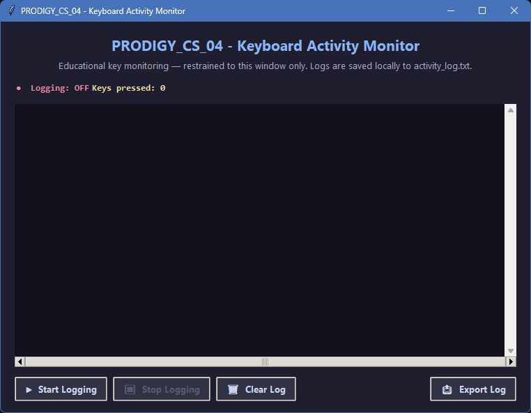
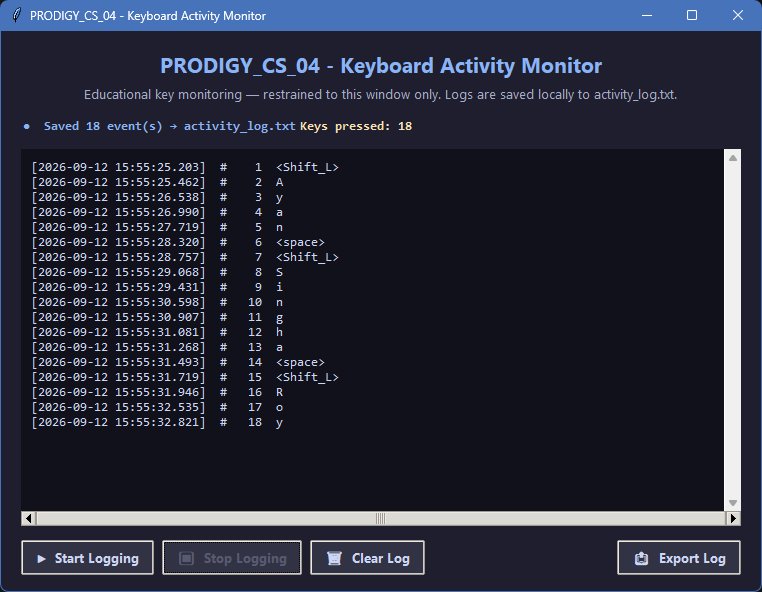
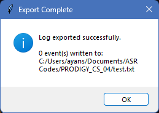

# PRODIGY_CS_04 - Keyboard Activity Monitor

> **Educational & Ethical**: This application monitors keyboard activity **only inside its own window**. It is not a keylogger.


---

## 📖 Project Overview

**PRODIGY_CS_04 - Keyboard Activity Monitor** is a modern, cross-platform desktop
application written in pure Python using **Tkinter** and the **standard library**
only. It demonstrates how to capture and log key presses **within the boundaries
of a single GUI window** — a safe, self-contained approach designed for
educational exploration of input handling.

The application gives the user full control over logging:

- 🟢 **Start Logging** — begin capturing keys while the window is focused
- 🔴 **Stop Logging** — stop capturing and flush events to `activity_log.txt`
- 🗑️ **Clear Log** — discard the current in-window log
- 📤 **Export Log** — save a complete, timestamped report to any location

Every key press is displayed in real time with a precise timestamp and the total
count of keys pressed is always visible in the status bar.

---

## ✨ Features

| Feature | Description |
|---------|-------------|
| 🔑 **In-window monitoring only** | Keys are captured only when the application window has keyboard focus |
| 🖥️ **Real-time display** | Every key press appears instantly in the scrollable log view |
| ⏱️ **Timestamps** | Millisecond-accurate timestamps for every key event |
| 🔢 **Live counter** | Total number of keys pressed, updated continuously |
| 💾 **Automatic logging** | Events are flushed to `activity_log.txt` when logging stops or the window closes |
| 🗂️ **Export utility** | Nativesave dialog to export a full, formatted report |
| 🎨 **Modern UI** | Themed dark interface with a professional banner and styled widgets |
| 🧩 **Object-oriented** | Clean separation of concerns via `ActivityLog` and `ActivityMonitor` classes |
| 🛡️ **Exception handling** | Graceful, user-friendly error reporting for file and GUI issues |
| 🌍 **Cross-platform** | Runs on Windows, Linux, and macOS |

---

## 📦 Installation

### Prerequisites

- **Python 3.8+** — [Download Python](https://www.python.org/downloads/)
- **Tkinter** — bundled with Windows and macOS Python installers

> On **Linux (Debian/Ubuntu)**, install Tkinter if missing:

```bash
sudo apt-get install python3-tk
```

### Steps

```bash
# 1. Navigate to the project folder
cd PRODIGY_CS_04

# 2. (Optional but recommended) Create a virtual environment
python -m venv venv

# Windows
venv\Scripts\activate

# Linux / macOS
source venv/bin/activate

# 3. No dependencies to install — Tkinter ships with Python!
# The requirements.txt documents the compatibility matrix only.
```

---

## 🚀 Usage

Run the application:

```bash
python keyboard_activity_monitor.py
```

A window titled **PRODIGY_CS_04 - Keyboard Activity Monitor** will open.

### Workflow

1. Click **▶ Start Logging** — the status label turns green (**Logging: ON**).
2. Click inside the window and begin typing. Every key press is captured with a
   timestamp and shown immediately in the log area.
3. Press special keys (`Enter`, `Shift`, arrows, etc.) — they are shown as
   symbolic names such as `<Return>`, `<Shift_L>`.
4. Click **⏹ Stop Logging** — the buffered events are saved to
   `activity_log.txt` in the same directory.
5. Use **🗑 Clear Log** to empty the in-window log at any time.
6. Use **📤 Export Log** to save a complete, formatted report to any location.

**Important:** Key presses are only recorded while the application window has
focus. Switching to another application immediately pauses capture.

---

## 🛠️ Technologies Used

- **Python 3.8+** — programming language
- **Tkinter** — built-in GUI toolkit (standard library)
- **ttk Themes** — modern themed widgets (`clam`/`alt`)
- **Standard library only** — `os`, `datetime`, `threading`, `tkinter`

No external packages such as `pynput` or `keyboard` are used.

---

## ⚠️ Ethical Considerations

This project was built for **educational purposes** and follows strict ethical
guidelines:

- ✅ **No system-wide capture** — keystrokes are only recorded while the
  application's own Tkinter window is focused.
- ✅ **No background monitoring** — the app is completely passive when unfocused.
- ✅ **No third-party monitoring libraries**.
- ✅ **No data exfiltration** — everything stays local on your machine.
- ✅ **Transparency** — the source is fully commented and auditable.

> **Never** use keyboard monitoring to observe others without their explicit,
> informed consent. Respect privacy at all times.

---

## 📷 Screenshots

| Screenshot | Description |
|------------|-------------|
| `screenshots/main_interface.png` | The main application window on launch |
| `screenshots/logging_demo.png`   | Live logging in action with real key events |
| `screenshots/exported_log.png`   | Example of an exported log report |

> Screenshots are stored in the [`screenshots/`](./screenshots/) directory.







---


---

## 🤝 Acknowledgements

- Built as part of the **Prodigy InfoTech** Cyber Security internship tasks
  (`PRODIGY_CS_04`).
- Thanks to the Python and Tkinter communities for excellent documentation.
